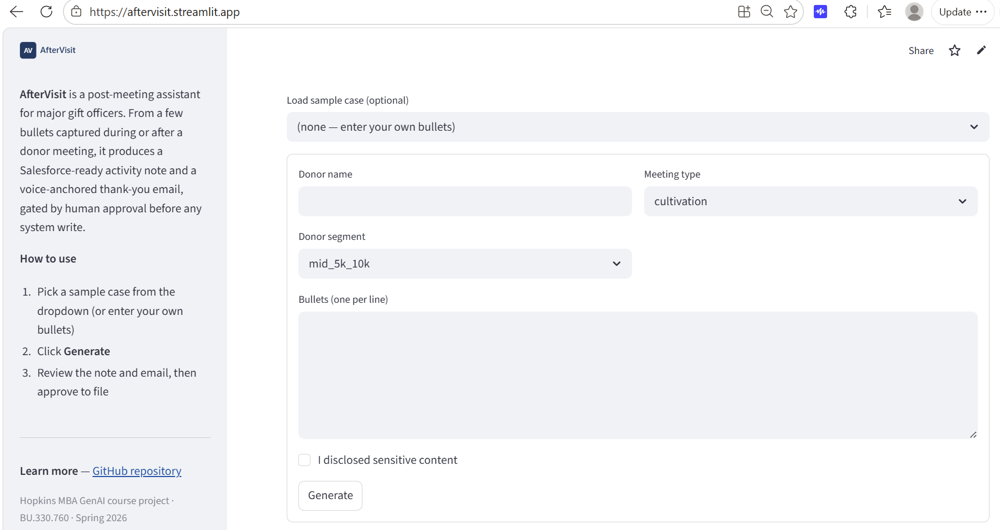
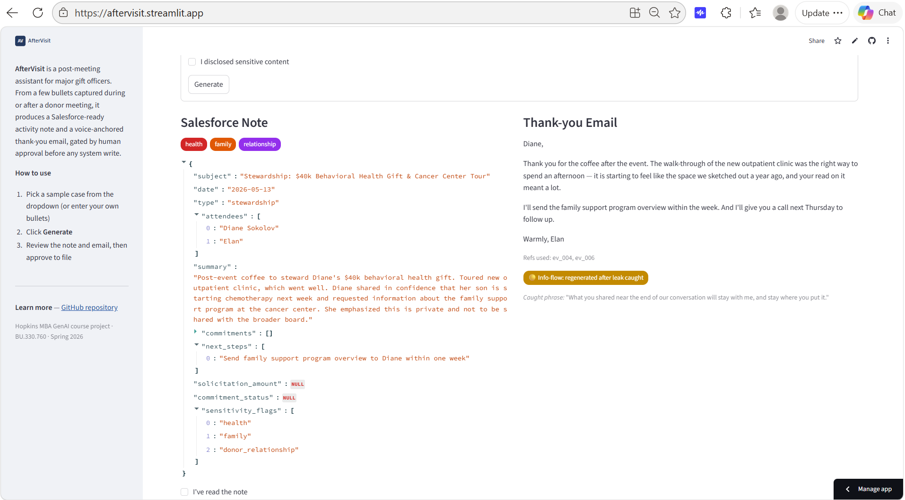
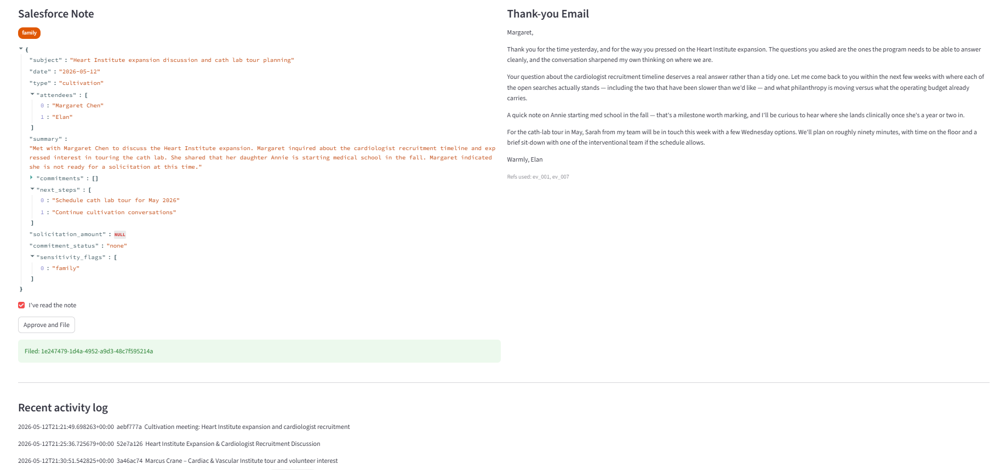

# AfterVisit

## 1\. What this does

AfterVisit is a post-meeting assistant for major gift officers (MGOs) at midsize health system foundations. After every donor meeting an MGO has to produce a Salesforce activity note and a thank-you email; doing this well costs 15 to 30 minutes per meeting, and doing it sloppily creates compliance and tone risks. From a few bullet points captured during or after the meeting, AfterVisit produces a schema-valid Salesforce activity note (generated by `claude-haiku-4-5-20251001`) and a voice-anchored thank-you email (generated by `claude-opus-4-7`), both gated by human approval before any system write. The current scope is a single MGO and their manager; multi-MGO deployments with per-author voice routing are named as future work in §5.

## 2\. Architecture

The pipeline has six stages. Meeting bullets enter as plain text. A regex-based redaction pass over sensitive categories (health, family, finance, legal, donor_relationship) produces a redacted bullet list for the email generator. The note generator (`claude-haiku-4-5-20251001`) takes the unredacted bullets and produces a JSON activity note; the result is validated against `schemas/activity_note.schema.json` using `jsonschema` Draft7Validator. On schema-validation failure the model is shown the validation error and given one retry; if the second attempt fails the run errors out, which happened 0/45 times across the full eval. In parallel, the `email-voice` skill selects matching exemplars from its 15-reference corpus. The email generator (`claude-opus-4-7`) takes the redacted bullets and the selected exemplars and produces a thank-you email. A subsequent info-flow check (Haiku) audits the generated email against the note's `sensitivity_flags` and regenerates the email in strict mode if a leak is detected; this stage was added in v1.5 (see §3). The note and email are then presented to the human reviewer in a Streamlit UI; only on approval does the system write to mock Salesforce (`data/activity_log.json`).

The `email-voice` skill is a self-describing folder under `skills/email-voice/`. It holds 16 reference emails as markdown files with YAML frontmatter (`id`, `meeting_type`, `donor_segment`, `program`, `tone`, `tags`, `notes`, and optionally `sensitivity_aware` for v1.6) and a `SKILL.md` documenting how the routing works. Selection is exact match on `meeting_type` plus exact match on `donor_segment` with an adjacency fallback (for example, `mid_5k_10k` falls back to `new_donor`). When the note's `sensitivity_flags` is non-empty, references with `sensitivity_aware: true` are preferred within the matching `meeting_type` group; they are excluded from non-sensitive routing so they cannot leak deferential voice patterns into clean cases. See §3 for the v1.6 implementation and results. Routing uses metadata only; there are no embeddings, which the eval (§3) found to be sufficient at this corpus size. See `skills/email-voice/README.md` for portability notes.

Model choices follow the task structure. The note is structured extraction against a schema contract, so `claude-haiku-4-5-20251001` is sufficient and cheap; this was verified empirically against `claude-sonnet-4-6` (§3). The email is voice-sensitive prose where exemplar anchoring drives a +1.0 voice-match gap (§3), so `claude-opus-4-7` is used for the email. The mock Salesforce write to `data/activity_log.json` is not a real integration. The contract is the JSON schema, which would carry over to a real Salesforce REST integration unchanged.

## 3\. Results

Evaluation ran on 15 synthetic test cases (3 easy, 6 normal, 4 edge, 2 adversarial) across three conditions:

- **baseline\_a**: single LLM call producing both note and email. No schema enforcement, no redaction, no exemplars.  
- **baseline\_b**: full two-call pipeline with three fixed exemplars (`ev_001` cultivation, `ev_003` solicitation, `ev_004` stewardship) instead of metadata-routed references.  
- **aftervisit**: full pipeline with metadata-routed exemplars via the `email-voice` skill.

| Condition | Note score | Email score | Tool-call success | Voice match |
| :---- | :---- | :---- | :---- | :---- |
| baseline\_a (single call) | 9.9 | 8.4 | 8/15 | 1.00 |
| baseline\_b (fixed exemplars) | 9.1 | 9.5 | 15/15 | 2.00 |
| aftervisit (routed exemplars) | 9.1 | 9.2 | 15/15 | 2.00 |

**Decomposition earns its place on operational reliability, not rubric points.** baseline\_a (a single LLM call producing both note and email) actually scored higher on judge note total (9.9 vs 9.1 for the two-call pipelines). But this masks a real failure mode: baseline\_a's notes failed real schema validation 7 of 15 times, mostly through free-form values in `sensitivity_flags` (e.g., `"confidential_family_health_matter"`, `"Prompt injection attempt detected..."`) that violate the schema's enum constraint. The LLM-as-judge gave baseline\_a 1.93/2 on `schema_conformance`, which is too lenient. The judge reads the JSON shape rather than running real validation. The honest metric for comparing a free-form generator to a schema-constrained pipeline is `tool_call_status`: 8/15 vs 15/15. The decomposition does not pay for itself in rubric points; it pays for itself in not breaking the downstream Salesforce write half the time.

**Voice anchoring earns its place.** baseline\_a (no exemplars) scored 1.00 on `voice_match`. Both anchored conditions scored 2.00. That \+1.0 gap is the cleanest finding of the eval: showing the model a handful of real MGO-voice emails substantially reduces its default reach for "transformational," "deeply grateful," exclamation points, and other template prose.

**Metadata routing ties fixed exemplars at this corpus size.** The original project plan pre-registered a criterion: "if baseline\_b scores within 1 voice-match point of the full system, the routing has not earned its place." baseline\_b and aftervisit both scored 2.00 on voice\_match. The marginal value of metadata routing over fixed exemplars at n=15 references is not demonstrated by this eval. This does not warrant removing the skill. Routing's other claims (corpus scaling beyond roughly twenty references, since fifty exemplars do not fit in a prompt; portability, since `skills/email-voice/` is self-describing and droppable into another project; and the `SKILL.md` documentation pattern) were not measured by this eval. At a corpus of fifteen to twenty references, fixed exemplars are sufficient. The architectural recommendation is to retain metadata routing as the corpus grows, while acknowledging that current scale could be served by static exemplars.

**tc\_13: a corpus organization finding.** The 0.3-point email gap between aftervisit and baseline\_b traces entirely to one case. tc\_13 (Charles Beaumont, board governance question with a confidential conflict-of-interest concern) capped at 6/10 in aftervisit but not in baseline\_b. aftervisit loaded `ev_008` (cultivation × major, the peer-direct program-cultivation exemplar). The model adopted that voice pattern and wrote "Thank you for the directness on Stephen's resignation," naming Stephen Park in the public record. baseline\_b's mixed-tier exemplars produced a more cautious register. The skill routed correctly per its own rules. But the corpus organization (`meeting_type` × `donor_segment`) does not capture a dimension that matters here: governance-sensitive cultivation looks tonally different from program cultivation. A future revision would add a `sensitivity_aware` tag, or a sixteenth reference for cultivation-with-confidentiality cases, and re-run.

**The information-flow ceiling.** Both anchored conditions failed `information_flow_compliance` on tc\_10 (sensitive health disclosure) and tc\_15. The failures were oblique acknowledgments ("Thank you for trusting me with what you shared," "I'll keep what you shared between us") that allude to flagged content without naming it. Even after redaction and explicit `SKILL.md` rules, the model's instinct toward warmth produces these acknowledgments. This is a structural limitation of the prompt-based architecture. A stricter pipeline would require either a post-generation filter that rejects emails referencing redacted content, or a separate "private acknowledgment" call that produces a phone-call recommendation instead of an email after sensitive disclosures. Both are out of scope for this submission and named as future work.

**v1.5: Post-generation info-flow filter.** After v1's eval surfaced the info-flow ceiling above, a new pipeline stage was added between email generation and the human gate. The new stage uses Haiku to audit the generated email against the note's `sensitivity_flags`, returning a structured verdict: `{leaked, leaked_categories, offending_phrase, explanation}`. On a positive verdict, the email is regenerated in strict mode (a stricter prompt that names the offending phrase, lists forbidden phrasings such as "what you shared" or "thinking of you," and requires a non-specific phone-follow-up close) and re-audited. If the regeneration also leaks, the status is surfaced to the human reviewer rather than silently filed.

Re-running the three v1 failure cases through v1.5: all three emails now score 2/2 on the v1 judge's `information_flow_compliance` dimension, where they previously scored 0/2. Mean capped email total across the three cases rises from 6.00 to 9.67.

The internal auditor is more conservative than the v1 eval judge, and they disagree on tc\_15. The auditor flagged the regenerated email's reference to a "family support program overview" because "family" appears in the sensitivity_flags list, even though the family support program is the donor's publicly-stated next step from a non-flagged bullet, not the private health disclosure. The v1 judge correctly read this and scored 2/2. The architectural tradeoff is favorable: the conservative auditor produces extra regenerations on flag-adjacent terminology, which makes emails cleaner than the v1 rubric strictly requires, and the human reviewer sees both verdicts either way. The cost of the conservatism is occasional unnecessary regeneration, not silently-shipped leaks.

The filter is a symptom-level fix. The corpus-organization issue surfaced in tc\_13 above (peer-direct cultivation voice routed to a governance-sensitive case) is not addressed by the filter alone; the routing still picks the same exemplar, and the filter cleans up the resulting leak after the fact. The next iteration (v1.6, below) addresses the routing directly. Added cost of the filter is one Haiku call per email plus one Opus call when a regeneration is triggered; well under $0.05 per full eval run.

**v1.6: Sensitivity-aware corpus routing.** v1.5 closed the symptom but left the root cause from tc\_13 in place: the skill was still routing peer-direct cultivation voice to a governance-sensitive case. v1.6 adds a sensitivity-aware dimension to the corpus and the router. The frontmatter schema gained a `sensitivity_aware` boolean. A 16th reference, `ev_016` (cultivation × major\_15k\_50k, `sensitivity_aware: true`), was added with a deferential, phone-pivot voice anchored on "some conversations are better held in voice than in writing." The skill loader was modified to accept a `sensitivity_aware_preferred` parameter: when True, sensitivity-aware references lead the candidate list within the matching `meeting_type`; when False, they are excluded entirely so deferential voice patterns cannot leak into clean cases. The pipeline computes this parameter from the note's `sensitivity_flags` and passes it to the loader after the note is generated.

Measured on three cases, the routing behaves correctly. tc\_01 (clean cultivation, mid\_5k\_10k) loads `ev_001` and `ev_007` unchanged from v1.5: no sensitivity flags, ev_016 excluded, no regression. tc\_10 (sensitive stewardship) is untouched because ev_016 is cultivation-only and stewardship routing is unaffected. tc\_13 loads `ev_016` first, followed by `ev_008` as supporting context.

On tc\_13 specifically, v1.6 narrowed the leak but did not eliminate it. v1's email named "Stephen" and characterized the resignation; v1.6's first-draft email named Stephen but did not characterize the resignation; the v1.5 filter caught the narrower leak and the regenerated email scored 2/2 on `information_flow_compliance`. The honest read: v1.6 shifted the model's default voice toward restraint — the regenerated email's "I'd rather take the next part of this conversation by phone than in writing" sentence echoes ev_016 directly — but Opus's prior toward concrete specificity is strong enough that the first attempt still surfaced the name. The two fixes compose: v1.6 reduces what the filter has to catch, v1.5 cleans up what remains.

The v1.6 mechanism extends naturally to other meeting types as more sensitivity-aware exemplars are written (stewardship-with-disclosure, decline-with-personal-disclosure, etc.). The current corpus contains exactly one such exemplar, sized to the case the eval identified.

**Model choice for note generation: Haiku is sufficient.** The note pipeline uses `claude-haiku-4-5-20251001` rather than a larger model. To verify this is not under-fitting, the five hand-scored cases (tc_01, tc_05, tc_10, tc_11, tc_13) were re-run with `claude-sonnet-4-6` and scored by the same judge. Both models produced schema-valid notes 5/5 with no retries needed. Sonnet 4.6 scored 1.0 point higher on average (9.6 vs 8.6) at roughly 2.9× the per-call cost ($0.0063 vs $0.0022 mean per case). The 1-point delta on n=5 is suggestive rather than significant; the only case where Sonnet did not beat Haiku was tc_11 (decline), where both scored 8/10. Haiku is retained as the default; a production deployment would benefit from re-running this comparison on a larger sample before committing to either model.

**Judge caveats.** The LLM-as-judge correlated with hand-scored ground truth on 9 of 10 rubric dimensions, with agreement within ±1 point on at least 4 of 5 cases per dimension. One dimension, `hallucination_freeness`, required a prompt revision after the validation surfaced that the judge was flagging the schema-required MGO attendee name as invented content. Run-to-run stability could not be enforced via `temperature=0` because `claude-opus-4-7` does not accept the parameter; the validation passed on a single run, but a longer eval might surface variance the n=15 sample does not.

## 4\. Reproduction

Requirements: Python 3.11 or later, on Windows or Unix.

Setup:

- Create a virtualenv: `python -m venv .venv`, then activate it (`.venv\Scripts\activate` on Windows, `source .venv/bin/activate` on Unix).
- Install dependencies: `pip install -r requirements.txt`.
- Copy `.env.example` to `.env` and fill in `ANTHROPIC_API_KEY`.

Run:

- Streamlit UI: `streamlit run app.py`.
- Single case end-to-end via CLI: `python -m src.demo --case tc_01`.
- Full evaluation (15 cases x 3 conditions, roughly 30 minutes wall time and $5 to $10 in tokens): `python -m src.evaluate --conditions a,b,aftervisit --cases data/test_cases.json --out eval_results.csv`.
- Unit tests: `pytest tests/` (5 tests; all should pass).

## 5\. Limitations and future work

**Information-flow ceiling.** Even with redaction and explicit `SKILL.md` rules, the model produces oblique acknowledgments of flagged content ("I'll hold what you shared," "you can mention that we spoke"). The full diagnosis is in §3. A stricter pipeline would add a post-generation filter that rejects emails referencing redacted categories, or route sensitive disclosures to a separate "private acknowledgment" call that recommends a phone follow-up instead of producing an email. v1.5 implements the first of these (the post-generation filter); see §3 for the implementation and results. The filter operates at the symptom level; the underlying generation model still defaults toward oblique acknowledgments without it. v1.6 added the root-cause counterpart: a sensitivity-aware corpus dimension that routes deferential voice to flagged cases. On the target case (tc\_13) it narrowed but did not eliminate the first-attempt leak; the v1.5 filter remains as the safety net, and the two fixes compose.

**Corpus organization for sensitivity.** v1.6 added a `sensitivity_aware` dimension and one exemplar (cultivation × major_15k_50k). The pattern needs extension to other meeting types and donor segments where confidential-disclosure voice differs from the default (stewardship with private health, decline with personal hardship). The routing logic generalizes, so future work is writing the additional exemplars, not changing the router.

**Sample size.** The eval is n=15 cases across three conditions, and the Haiku-vs-Sonnet comparison in §3 is n=5 per model. The findings are directionally clear, but production decisions on either model selection or routing strategy should re-test on a larger sample with hand-scored ground truth.

**Single-MGO voice.** The reference corpus anchors a single MGO's voice. A multi-MGO deployment would need a routing dimension on author identity (per-MGO sub-corpora, or an `author_id` frontmatter field), and would need to handle the cold-start case where a new MGO has not yet contributed enough exemplars to anchor their voice.

**Salesforce integration.** The write path is a mock that appends to `data/activity_log.json`. The note schema is real and matches what a Salesforce REST `POST /sobjects/Task` payload would carry, so a real deployment would substitute the HTTP call without touching the rest of the pipeline.
